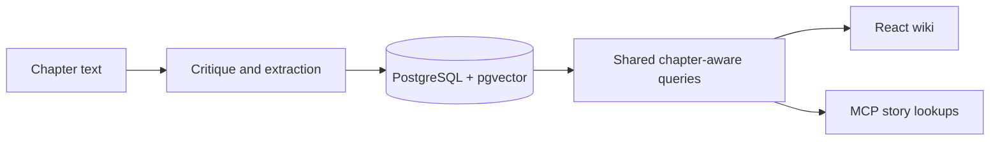

# Continuum

**A story wiki and continuity checker that grows with your novel.**

Continuum turns chapters into a searchable record of characters, places,
relationships, possessions, plot threads, and who knows what. Browse that record
in a web app, or connect a writing agent through the Model Context Protocol (MCP)
so it can consult earlier chapters while drafting.

For example, when working on chapter 12, you can look up what a character knew
at the end of chapter 11, find an unresolved promise, or check a draft against
established facts. Continuum analyzes the prose you provide; writing stays with
you and your tools.

[Getting started](#getting-started) · [Architecture](#how-it-works) ·
[Documentation](#documentation) · [Contributing](#contributing) · [Apache-2.0 license](LICENSE)

## What you can do

- **Build a story wiki:** extract characters, locations, objects, factions,
  events, relationships, scenes, and plot threads from chapter text.
- **Look back without spoilers:** set a chapter cutoff to browse the story as
  it was known then, including character state and versioned metadata.
- **Find relevant passages:** search chapter text, summaries, and events using
  keyword and embedding search together.
- **Review continuity:** inspect findings about established facts, character
  knowledge, possessions, and possible commitment payoffs.
- **Adapt extraction to your setting:** choose LitRPG, High Fantasy, Xianxia,
  Sci-Fi, or Contemporary presets when creating a novel, or define your own
  entity types. These configure categories such as skills, deities, or
  technologies and their extraction descriptions; they do not add separate
  genre-specific continuity rules.
- **Give a writing agent memory:** MCP tools expose story lookups, continuity
  checks, and chapter submission with a human review queue for failing drafts.

## Project status

Continuum is an **experimental project for local, trusted use**. Core workflows
have been checked with real Gemini calls on novel chapters, PostgreSQL
regression tests, and browser checks.

Extraction can miss or misclassify facts, and continuity findings need human
judgment. The app has no authentication; a public deployment needs access
controls.

## Getting started

### Requirements

- Python 3.11+ and [uv](https://docs.astral.sh/uv/getting-started/installation/).
- Node.js 22.13+ on the 22.x line, or 24+, with npm.
- A running PostgreSQL installation with [pgvector](https://github.com/pgvector/pgvector),
  plus the `createdb` and `psql` command-line tools. CI uses PostgreSQL 16.
- A Gemini API key for the default configuration. Other providers can be
  configured through LiteLLM; see the [backend configuration guide](backend/README.md#environment).

The commands below assume your local PostgreSQL role can create databases and
enable extensions. Set `DATABASE_URL` to match your own PostgreSQL setup.

### 1. Install the backend and prepare the database

```bash
git clone https://github.com/naman159/continuum.git
cd continuum/backend
uv sync --frozen
cp .env.example .env

createdb novel_wiki
psql -d novel_wiki -c 'CREATE EXTENSION IF NOT EXISTS pgcrypto;'
psql -d novel_wiki -c 'CREATE EXTENSION IF NOT EXISTS vector;'
```

Edit `backend/.env` before continuing. The supplied configuration uses:

```dotenv
DATABASE_URL=postgresql://localhost/novel_wiki
GEMINI_API_KEY=your-gemini-api-key
DEFAULT_MODEL=gemini/gemini-3.1-flash-lite
EMBEDDING_MODEL=gemini/gemini-embedding-2
EMBEDDING_DIMENSIONS=768
USE_MOCK_LLM=false
```

Chapter text and story context are sent to your configured model and embedding
providers. Processing makes multiple API calls per chapter and may incur costs;
long chapters and provider rate limits can make it take several minutes.

From `backend/`, initialize the schema and start the API:

```bash
uv run novel-pipeline init-db
uv run novel-webapp
```

### 2. Start the web app

In a second terminal, from the repository root:

```bash
cd frontend
npm ci
npm run dev
```

Open [localhost:5173](http://localhost:5173). The frontend connects to the API
on port 8000. Interactive API documentation is available at
[127.0.0.1:8000/docs](http://127.0.0.1:8000/docs).

### 3. Process your first chapter

1. Select **New Novel**, enter its details, and choose any extra entity types.
2. On the **Process** page, paste your first chapter and submit it as chapter 1.
3. Browse the extracted characters, timeline, relationships, and search results.
   Review continuity findings and any extraction warnings.
4. Add chapter 2, then use the chapter cutoff to compare the story at each point.

Chapters must be processed in order, starting at 1. Replacing an earlier chapter
reprocesses it and every later chapter, including fresh model calls. The database
update is atomic: a failed replacement preserves the previous saved version.

Prefer the command line? From `backend/`:

```bash
uv run novel-pipeline create-novel --title "My Novel"
# Replace NOVEL_ID with the ID returned above, and use your chapter's file path.
uv run novel-pipeline process-chapter --novel-id NOVEL_ID --number 1 --file chapter1.txt
```

### Optional: run without an API key

Set `USE_MOCK_LLM=true` in `backend/.env` and restart the API. You can use
[`backend/evals/golden/ch01.txt`](backend/evals/golden/ch01.txt) to explore the
interface. This mode uses deterministic mock extraction and hash embeddings; it does
not evaluate your prose or demonstrate model quality. MCP `save_chapter` refuses
writes in this mode because no real continuity verdict is available. Use a
separate database for this demo and for real-provider work.

### Optional: serve the built app from one process

Run `npm run build` in `frontend/`, then start `uv run novel-webapp` from
`backend/`. Open [127.0.0.1:8000](http://127.0.0.1:8000); the separate Vite
development server is no longer needed.

## Connect a writing agent

The MCP server runs over stdio. With the backend configured, add it to an
MCP-compatible client using an absolute path to your checkout:

```json
{
  "mcpServers": {
    "continuum": {
      "command": "uv",
      "args": ["run", "--directory", "/path/to/continuum/backend", "novel-mcp"]
    }
  }
}
```

For Claude Code, the repository includes [`.mcp.json`](.mcp.json). To register
the server from another directory:

```bash
claude mcp add continuum -- uv run --directory /path/to/continuum/backend novel-mcp
```

Story lookups accept `writing_chapter`: an agent drafting chapter N sees facts
only through chapter N−1. A typical workflow is to look up characters, open
threads, and unresolved commitments, draft a chapter, call `check_continuity`,
revise, and call `save_chapter`.

`save_chapter` runs its own continuity check. Failing drafts go to the wiki's
**Review** page for a human decision; a missing or unavailable critic refuses
the write. The CLI and Process page save chapters with findings for the user
to review. See the [MCP reference](docs/reference.html#mcp-server) for tool details.

## How it works



One Python pipeline coordinates critique, 13 extraction passes per text chunk,
entity resolution, transactional persistence, and state rebuilding. The API,
CLI, and MCP chapter writers use that same pipeline. A per-novel lock prevents
overlapping writes.

Recorded state changes and knowledge assertions rebuild character state;
metadata history supports reads at earlier chapters. Both the wiki and MCP use
the shared query layer in `backend/reads/`. Replaying stored assertions is
deterministic; extracting again from prose can produce different results.

| Directory | Purpose |
| --- | --- |
| [`backend/pipeline/`](backend/pipeline/) | Extraction, continuity checks, retrieval, state replay, and database schema |
| [`backend/reads/`](backend/reads/) | Shared queries with chapter cutoffs |
| [`backend/api/`](backend/api/) | FastAPI endpoints and processing jobs |
| [`backend/mcp_server/`](backend/mcp_server/) | Tools for writing agents |
| [`frontend/src/`](frontend/src/) | React and TypeScript wiki |
| [`backend/evals/`](backend/evals/) | Evaluation fixtures and scoring |
| [`docs/`](docs/) | Architecture, reference, audits, and development notes |

## Limitations and upgrades

- Entity resolution can create duplicates across different entity types. The
  wiki supports inspecting and merging them, but ingestion does not prevent all
  such duplicates.
- Processing-job status is held in memory and does not survive a server restart.
- Changing embedding dimensions requires a fresh database and re-embedding;
  `init-db` rejects incompatible existing vector columns.
- After upgrading, stop chapter processing and run `uv run novel-pipeline init-db`
  from `backend/`. Existing chapters are retained. Older databases receive a
  metadata baseline at their latest chapter; metadata from before that baseline
  cannot be reconstructed. Re-import the original chapters into a new novel if
  you need that earlier history.

See the [architecture conformance review](docs/architecture-conformance.md) and
[known gaps](docs/state-of-the-system.html) for the detailed boundaries.

## Documentation

Open [`docs/index.html`](docs/index.html) locally in a browser for the documentation
site. GitHub displays the HTML source. To serve it locally, run
`python -m http.server 9000 --bind 127.0.0.1 --directory docs` from the repository
root and open [127.0.0.1:9000](http://127.0.0.1:9000).

- [Architecture](docs/architecture.html): data flow, schema design, and implementation.
- [Reference](docs/reference.html): API endpoints, CLI, MCP tools, and configuration.
- [Backend guide](backend/README.md) and [frontend guide](frontend/README.md): development details.
- [Building Continuum](docs/blog/README.md): the reasoning behind the design.

## Contributing

Bug reports, documentation fixes, tests, and focused code contributions are
welcome. Use [GitHub Issues](https://github.com/naman159/continuum/issues) to
report a problem or discuss a larger change before implementing it.

For a bug report, include the steps to reproduce, expected and actual behavior,
your OS and relevant dependency versions, and redacted error output. For an
extraction issue, include the provider/model and a short passage you can share.
Keep API keys, database credentials, and private manuscripts out of issues and PRs.

Fork the repository, make your change on a branch, and open a pull request with
the problem, the change, and how you verified it. Keep changes focused, add
regression coverage for behavior fixes, and update the docs when behavior changes.

### Run the checks

Backend checks need a real PostgreSQL database with pgvector. Use a separate test
database. From `backend/`, these commands disable local `.env` overrides and
paid provider evaluations for this shell session:

```bash
createdb novel_wiki_test
psql -d novel_wiki_test -c 'CREATE EXTENSION IF NOT EXISTS pgcrypto;'
psql -d novel_wiki_test -c 'CREATE EXTENSION IF NOT EXISTS vector;'
export PYTHON_DOTENV_DISABLED=1
export DATABASE_URL=postgresql://localhost/novel_wiki_test
export USE_MOCK_LLM=true
unset RUN_LLM_EVALS

uv sync --frozen --dev
uv run novel-pipeline init-db
uv run ruff check .
uv run pytest -q
```

Run frontend checks from `frontend/`:

```bash
npm ci
npm run lint
npm run typecheck
npm run build
```

[CI](.github/workflows/ci.yml) runs these lint, test, typecheck, and build checks
on pushes to `main` and pull requests. Routine tests use deterministic model
responses and need no provider credentials. They check software behavior;
model quality needs separate evaluation with real prose and real providers.

If your database seems unexpected during normal development, check for
`backend/.env.branch`: it overrides `.env`. Run `backend/scripts/branch_db.sh show`
from the repository root to inspect the active configuration.

## License

Copyright 2026 Naman Ranawat.

Continuum is licensed under the [Apache License, Version 2.0](LICENSE).
See [NOTICE](NOTICE) for project attribution. Commercial use and modification
are permitted subject to the license terms, including applicable redistribution
and notice requirements. The software is provided without warranty.
